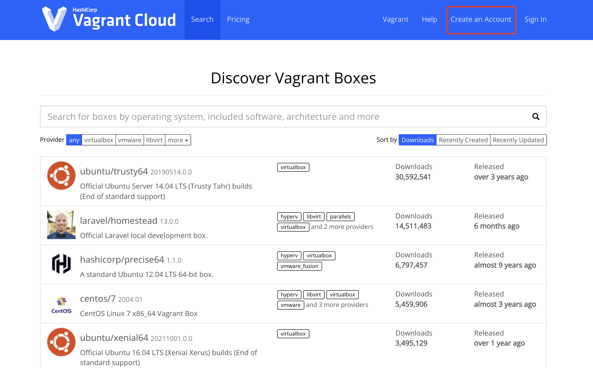
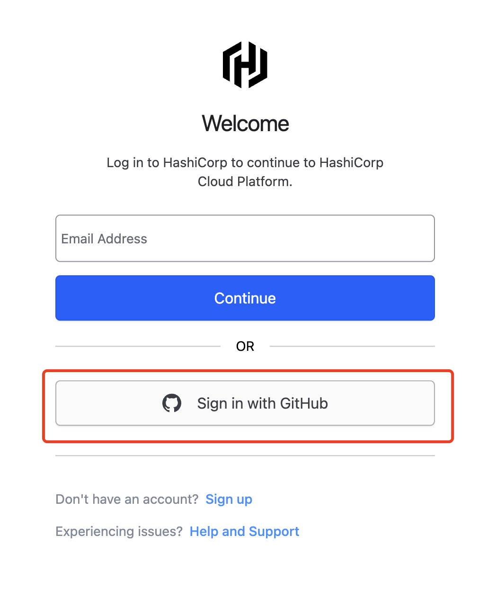
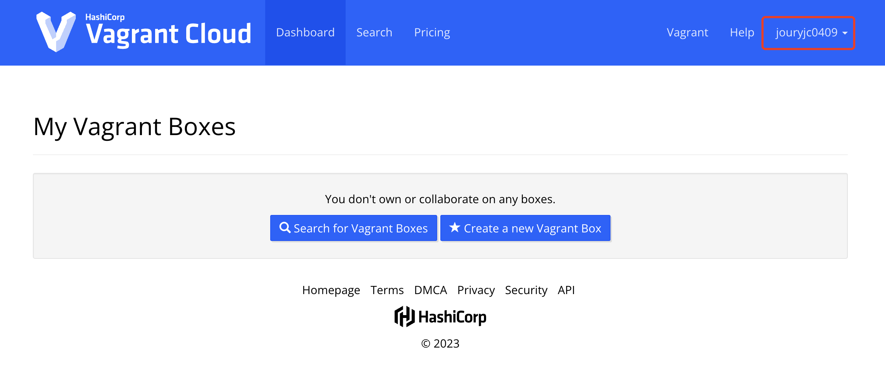
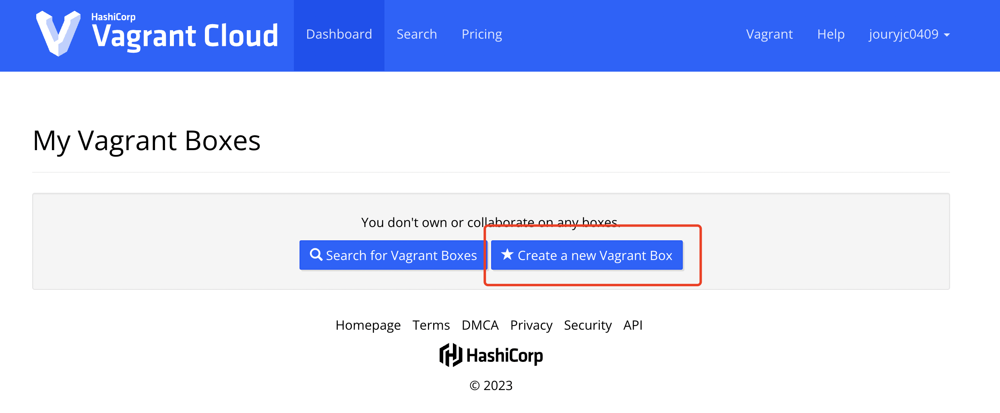
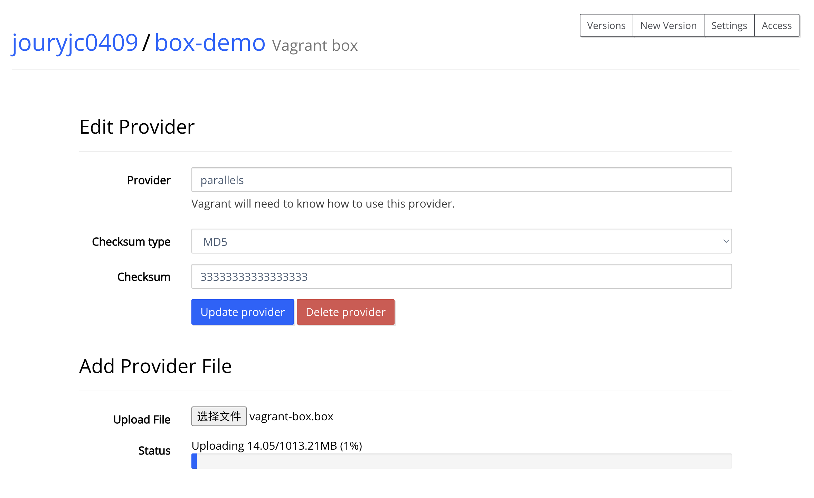
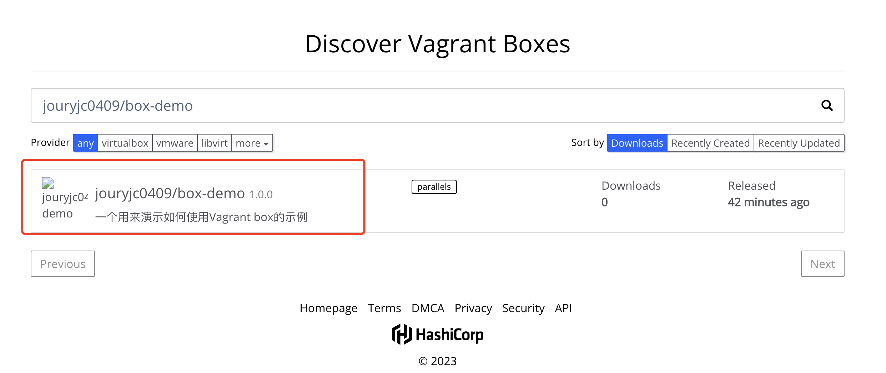

# 快速同步虚拟机配置的方法
> [Vagrant](https://github.com/hashicorp/vagrant) 是一个用于快速同步开发环境中虚拟机配置的工具。

## Vagrant 基础指令
```shell
# 通过默认的 box 创建 Vagrantfile
vagrant init box

# 通过 Vagrantfile 启动虚拟机
vagrant up

# 查看虚拟机状态
vagrant status

# 通过 ssh 进入到指定的虚拟机环境
vagrant ssh

# 校验Vagrantfile的语法合法性
vagrant validate

# 将Vagrantfile构建并输出box格式的文件
vagrant pacakge
```

### 上传到 Vagrant Cloud
如果你也想把自己的配置与他人共享，可以将Vagrantfile生成.box文件之后提交到 [Vagrant Cloud](https://app.vagrantup.com/boxes/search)，这样其他同学可以很快地同步到你的环境要求。效率嘎嘎的~

我们要将一个本地虚拟机配置上传到 Cloud 中，只需要做一下几步即可：
1. 先去 Vagrant Cloud 注册创建一个用户；  


  
  

右上角能够显示用户名说明已经创建完成


2. 然后将自己本地的 Vagrantfile 构建成 box 文件，执行以下命令即可：
```shell
vagrant package --output vagrant-box.box
```
执行上述命令时，会要求将虚拟机启动。执行成功后，会在当前目录上生成一个 .box 格式的文件。

3. 接着我们前往 Vagrant Cloud 创建一个 box；

填写完信息之后，就会到上传 box 阶段。

4. 最后将第2步生成的 box 文件上传到上述 box 中即可。


5. box 文件上传成功之后，release 发布之后，便可以在 Vagrant Cloud 中看到。



## 插件
[Vagrant plugin](https://developer.hashicorp.com/vagrant/docs/cli/plugin) 也可以使用很多插件，比如常用的插件如下：
- vagrant-parallels 可以将 vagrant 和 Parallel Desktop 结合起来使用。
- vagrant-scp 可以将 host 文件同步到虚拟机中。
- ……持续更新……

## 相关链接
[vagrant](https://www.vagrantup.com/)

